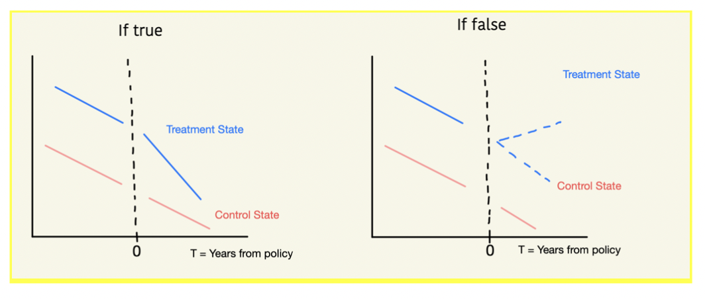

# Final Project
Unifying Data Science | Spring 2021

## Topic
Our project seeks to investigate the relationship between state drug screening policies and the rate of applications for public assistance (TANF).

## Motivation
In recent years, 15 state welfare offices have implemented drug screening questionnaires for those applying for public assistance (TANF). While suspicionless testing has been ruled unconstitutional, these questionnaires are used to determine probable suspicion. Should an applicant be suspected of drug use, they are required to take a drug test before receiving welfare. A positive welfare test can trigger a referral to a substance use disorder treatment program, temporary disqualification from benefits, or a child services investigation, depending on the state.
This drug screening policy may deter people from applying for welfare and thus may decrease the TANF caseload. A caseload reduction has many negative effects. For example, children may be left without food or resources because of their parent’s choice to not apply for welfare for fear of a drug test. Parents may not be referred to services they need if they do not want to fill out a drug questionnaire and potentially have to undergo a drug screening.
Caseworkers see TANF clients on a semi-regular basis as part of the program requirements, but they can’t see people who don’t come in. If drug screening requirements deter people from applying for TANF, this policy may create a barrier to access supportive services.

## Project Question
Did the implementation of states’ drug screening policies significantly reduce their TANF caseloads?
If we find a causal effect, we may also investigate whether the magnitude of this effect differs based on family composition (1-Parent vs. 2-Parent vs. 0-Parent Families).

## Project Hypothesis
We anticipate that TANF caseloads significantly decline after drug screening policies are implemented.

## Model Results
If the hypothesis were true, we would see a negative and statistically significant coefficient on the interaction between treatment variable and the post-policy variable, for all states where a policy was implemented, after controlling for relevant covariates.
If false, we would see either a positive and significant coefficient, or an insignificant coefficient, on the interaction between treatment variable and the post-policy variable, for all states where a policy was implemented, after controlling for relevant covariates.
Our analysis involves a number of difference-in-difference (DD) graphs and accompanying regressions.
- 1 DD with all states who implemented drug screening policies (“treatment” states) v. all states who did not implement drug screening policies (“control” states)
- 15 state-specific DDs: one for each treatment state and a control subset of one to five neighboring states with similar pre-policy trends

## Variable Selection
A treatment variable that indicates whether or not that state implemented a TANF drug screening policy.
- A time variable that covers before and after the policy implementation, with a sufficient number of years on either side (4-10 years).
- The outcome variable of the average number of families on TANF per state in a given calendar year.
- State fixed effects.
- Relevant covariates:
+ State unemployment rate
+ Percent of people in the state below the federal poverty level

## Data Sources
### Number of families on TANF a. Source: ACF
* For a sample PDF of broad caseload data, see here
* For a sample PDF of more detailed characteristics of recipients, see
here

### American Community Survey state-level data on race, unemployment, income, and education in the state
* Source: IPUMS or Duke’s Social Explorer Tool
* User-specified table detailing which states implemented their drug screening
policies in which year a. Source: NCSL

We will merge these datasets on state.
